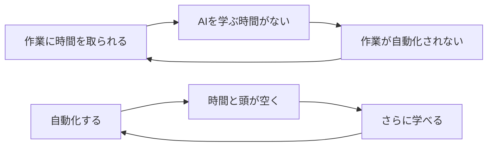

## 「すぐには理解できないが、正しいことを言っているのだと思う」

週次の報告会で、上司がそう言った。

私はAIで作ったスライドとHTMLレポートを画面に映していた。上司は内容を否定しなかった。むしろ、正しいと言ってくれた。理解はできないけれど、正しいのだと思う、と。

そのときの私は、それを好意的な反応として受け取っていた。今になって思えば、あれはレビューが壊れた瞬間だった。

私は大手製造業のDX推進部門でマネージャーをしている。この1年ほど、チームの若手中堅メンバーと一緒にAI活用を進めてきた。体感の生産性は3倍になった。そして同じ時期に、私たちは上司とベテランメンバーを置き去りにした。

これは、その置き去りがどう起きて、何を壊したかの記録である。先に結論を書いておく。**置き去りは誰の悪意でも怠慢でもなく、構造で起きる。そして置き去りにした側も損をする。**

登場人物に悪役はいない。上司は誠実だった。ベテランは真面目だった。若手は優秀だった。それでも壊れた。だからこの話は、たぶんあなたの組織でも起きる。

**対象読者**：組織のAI活用を推進している人、チーム内のAI活用の温度差にモヤモヤしている人、「一部の若手だけが突っ走っている」と感じている管理職。ソフトウェア開発の現場の話ではないが、たぶん同じことが起きている。

---

## 私たちが走った道

前提として、私たちがどこから来たかを書いておく。

私は製造現場出身で、転職を機にPythonを1から勉強した。製造ライン向けのアプリを現場に入れるようになり、やがてAIコーディングを使い始めた。

現場向けのアプリを何本か作るうちに、標準化の必要を感じるようになった。作る人によって構造がバラバラで、引き継げない。標準仕様を作ろうとしていたところで仕様駆動開発という思想を知り、Claude Codeでそれを回す取り組みを始めた。

この頃から、チームの空気が変わった。取り組みメンバー——30代前後の若手中堅が中心だった——と議論しているうちに面白くなって、気づけばプライベートの時間にも情報を集め、試すようになっていた。私たちは業務時間の外で学んでいた。

やがて活用はコーディングの外に出ていった。

本社や幹部への報告資料は、それまで1週間くらい頭を支配される仕事だった。何を主題に置くか、どの順で見せるか、想定質問は何か——手を動かしていない時間もずっと頭の片隅で回り続ける。それがAIとの壁打ちなら、1日集中すればだいたい形になる。もちろんそこから手直しはする。それでも、頭を占有される期間が1週間から1日になった。

アプリ開発は、仕様さえあれば待っているだけで出来るようになった。気を使うメールの下書きは一瞬で出る。打ち合わせのメモを雑多に投げれば、ToDoとテーマの進捗が自動で更新される。最後のものは自分用の秘書エージェントで、markdownのリポジトリを記憶の置き場にして、AIがそれを読み書きしながら育っていく仕組みにしてある。

体感の生産性は3倍になった。この「3倍」が何の3倍なのかは、はっきりしている。**作業のスピードではなく、同時に抱えられるテーマの数だ。**

解放されたのは時間ではなく、頭の占有だった。1週間ずっと資料に支配されていた頭が空けば、その分だけ他のことを考えられる。1件あたりが3倍速く終わるのではなく、並行して持てる件数が増える。だから体感は「少し速くなった」ではなく「働き方が別のものに変わった」に近い。

このとき私たちは、自分たちが何を置き去りにしているかに気づいていなかった。

---

## 効率化は見えない場所で起き、見える場所で爆発した

置き去りが表面化したのは、報告会だった。

考えてみれば当然で、**AIコーディングは上司から見えない場所で進んでいた**。コードが速く書けるようになっても、上司の目に入るのは成果物とスケジュールだけだ。1年かけて起きていた変化は、上司にとっては「順調に進んでいるらしい」という以上の解像度を持たなかった。

それが、AIで作ったスライドとレポートが報告会に出てきた瞬間に可視化された。上司にとってそれは、1年かけた段階的な変化ではなく、ある日突然現れた断絶だった。驚くのが当たり前である。

ここから一般化できることがある。**置き去りは進行中には気づかれず、可視化された瞬間に一気に表面化する。** そして表面化したときには、もう差は1年分ついている。

そして見えた瞬間から、壊れ始めたものがあった。レビューである。

---

## レビューが、上下両方向で壊れた

これがこの話の中心にある。**壊れたのは個人の能力ではなく、レビューという組織の品質保証機構だった。** しかも上下の両方向で、同時に。

### 上から私へのレビューが機能しなくなった

冒頭の「正しいことを言っているのだと思う」に戻る。

AI製の資料は情報が濃い。加えて、AIと壁打ちしながら考えを詰めているぶん、私自身の視座も上がっていた。結果として、上司がレビューできる点がなくなった。

「正しいと思う」は信頼の言葉であって、検証の言葉ではない。レビューの本来の機能は誤りを見つけることなのに、そこから検証が抜けて承認だけが残った。信頼それ自体は美徳だが、レビューにおいては機能不全の症状である。

この頃から、上司の言葉に変化が現れた。「中身にはついていけなくて、申し訳ない」「持ち帰ってちゃんと読む」「勉強します」「教えてください」。職制上の関係は何も変わっていないのに、知識の勾配だけが逆転していた。**レビューの場が、いつのまにか謝罪の場になっていた。**

念のため書いておくと、上司は誠実だった。自分のギャップを公の場で認め、メンバーに向かって「AIで急速に変化が起きている。自分が一番キャッチアップが必要だが、分からないことは自分で調べて、この場で質問していこう」と言える人だった。できることをやっていた。それでも壊れた。

### 作っても、定着しなかった

象徴的な出来事がある。

上司には、報告用の定型集計業務があった。手元のデータを所定のフォーマットにまとめるだけの仕事に見えるが、実際には例外的な扱いをする項目がいくつもあり、そのルールは上司の頭の中にしかなかった。毎回それなりの時間を取られていた。

私はまず、そのルールを本人に書き出してもらった。それをもとにアプリ化し、マニュアルを付けた。さらに「このアプリをどうやってAIと作ったか」の手順をレポート形式でまとめて添えた。作り方まで見てもらえば、AIでアプリを作るという感覚を少しでも掴んでもらえると思ったからだ。ここまで3時間だった。

結果を書く。上司はそれを、次の集計タイミング——1ヶ月後——までまともに触らなかった。そして触らないうちに使い方が分からなくなり、最終的にアプリごと集計業務を別のメンバーに渡すことになった。自動化は、業務移管に化けた。

作り方のレポートも、たぶん誰も読まなかった。良かれと思って添えたものだったが、そもそも読まれない前提が抜けていた。

ここで白状しておくことがある。**私はこのとき、あえてOJTをほとんどしなかった。** 実験のつもりだった。マニュアルも手順も揃っているのだから、読んで試して、詰まったら調べて動かせるはずだ——そう考えていた。今思えば、これは実験ではなく、教える手間を惜しんだ自分への言い訳だった。

無理だった。

ここから学んだことが2つある。

ひとつは、「説明を読んでやってみる、詰まったら調べてまたやってみる」という自走力は、当たり前のように見えて実は希少なスキルだということ。マニュアルを配れば全員が使えるようになる——そんな前提が成り立った現場を、私は見たことがない。エンジニアの世界にいると自走力は基礎スキルに見えるが、人間のデフォルトはたぶん逆側にある。

もうひとつは、こちらの方が重要で、**管理職は時間の貧困ループの最も深いところにいる**ということだ。上司には自分の会議があり、部門の調整があり、上からの依頼がある。「持ち帰ってちゃんと読む」と言った本人が一番、持ち帰って読む時間を持っていない。私は自走力の問題だと思っていたが、その手前に時間の問題があった。**新しいことを覚える時間が最もない人に、新しいことを覚えてもらおうとしていた。**

そしてもうひとつ。**開発リードタイムはAIで潰せたが、定着リードタイムは潰せなかった。** 作るのは3時間で済む。しかし定着は人間の時間で動く。AIによって開発が速くなればなるほど、ボトルネックは開発から定着へ移動する。

### 上から若手へのレビューも機能しなくなった

逆方向でも同じことが起きていた。

AI活用を進めていた若手メンバーの報告に、あるときから違和感を覚えるようになった。自分の専門から外れたテーマについて説明するとき、資料はきれいにできているのに、自分の言葉になっていない。詰まるわけではない。劇的な破綻もない。ただ、書いてあることをそのまま読んでいるように聞こえる。そういう場面が、一度ではなく増えていった。

そして上司は、それを指摘できなかった。

私はここで、AIが何を壊したのかを理解した。**これまで「資料が書けない」ことは「理解していない」ことの検知器だった。** 分かっていない人間には、それらしい資料が作れない。だから資料作成自体が理解度のテストとして機能していた。AIはこれを壊した。資料の完成度と本人の理解度が、切り離されてしまった。

検知器は資料から質問へ移った。本人の言葉かどうかを見抜くには、的確な質問をぶつけるしかない。ところが、AI活用についていけていない上司には、その質問が出せない。**検知器が移った先に、検知できる人がいなかった。**

正直に書くと、私もその場では質問しなかった。できなかったのではなく、しなかった。人前で答えられない状態を作れば、それは指摘ではなく晒しになる。そこで恥をかかせるのは違うと思った。

ここに、この問題の厄介さがある。**質問という検知器には、相手に恥をかかせるという副作用がついてくる。** 上司は質問できず、私は質問しなかった。理由はまるで違うのに、検知されなかったという結果だけが同じだった。

これを書く資格が私にあるとすれば、同じことを先にやったからだ。学生時代、論文やネットから拾った言葉をそのままスライドに貼り付けて発表し、先輩か教授に質問されて答えられず、こっぴどく叱られたことがある。以来「自分の資料は一言一句自分の言葉で説明できなければならない」を自分のルールにしてきた。**この原則はAI以前からある。AIは、この失敗モードを大量生産できるようにしただけだ。**

だから若手を責めるつもりはない。むしろ逆で、AIがなければ彼は「勉強して出直します」と言っていたはずなのだ。AIがあると、できてしまう。能力の前借りは道具の性質であって、本人の資質の問題ではない。

分断は上下だけではなかった。横にも走っていた。

---

## 時間の貧困ループと、双方向の恨み

AIを使うメンバーは、資料作成もデータ集計も極力自動化して、空いた時間を創造的な仕事に使う。あるいは、単に楽をする。使わないメンバーは、相変わらず資料作成とデータ集計に時間をかけている。同じ職場で、時間の使い方が非対称になった。

そして、この非対称は自己強化する。

作業に時間を取られている人には、AIを学ぶ時間が生まれない。学ばないから作業が減らない。減らないから学ぶ時間が生まれない。一方で自動化した側は、空いた時間でさらに学んで差を広げる。仮に**時間の貧困ループ**と呼ぶことにする。

同じ職場に、逆向きに回る2つのループが立っている。**分断は、放置しても自然には解消しない。**

しかも奪われているのは時間だけではない。前に書いた「頭の占有」がここで効いてくる。来週の報告資料に頭を支配されている人は、仮に空き時間を与えられたとしても、その頭では新しいことを学べない。**時間を作ってあげるだけでは解決しない。** 占有そのものを外す必要があり、そのための道具がAIなのだから、ループの入口はAIしかない。堂々巡りに見えるが、だからこそ外からの介入が要る。

やがて、チームから共通言語が消えた。AI活用の話をしても通じない。「ただただ凄いことをやっている人たち」という見られ方になった。それは理解ではなく、畏怖である。

ここで、私の側の感情も正直に書いておく。当時の私たちには苛立ちがあった。自分たちばかりが仕事をこなしている。なぜ自分で情報を取りに行かないのか。なぜ勉強しないのか。

これは間違いだった。

プライベートの時間を投じて学んだ人間は、学ばないことを**意欲の問題**として道徳化してしまう。私はまさにその罠にはまっていた。実際には、学習機会の構造の問題だったのに。私たちが学べたのは意欲が高かったからではなく、たまたま面白いテーマに当たって、たまたまその時期に自分の時間を使えたからだ。

分断が完成するのは、技術の差がついたときではない。**お互いが相手を道徳的に責め始めたときだ。**

だが、いちばん静かで、いちばん危険な反応は別の場所にあった。

---

## ベテランの、静かな退場

40代以降のベテラン層の反応は、上司とは違った。

上司は驚き、動揺し、ついていこうとした。ベテランからは、あきらめを感じた。自分たちはもう、自分が知っていることでやっていこう——そういう静かな退避だった。

上司はこの状況に危機感を持っていた。ベテランメンバーのことも、ちゃんと心配していた。だからこそ「分からないことは自分で調べて、この場で質問していこう」と言ってくれていた。

それでも、質問が出なかった。

**あきらめが可視化された形は、質問が出ないことだった。** 驚きは声になるが、あきらめは声にならない。声にならないから問題として表面化せず、表面化しないまま固定化する。だから私は、畏怖よりあきらめの方が危険だと思っている。

そして、ここが自分にとって一番痛い部分なのだが——質問が出なかった理由の一端は、間違いなく私にある。

私は普段から、浅い発言にはすぐに厳しく追及していた。悪気はなく、議論の質を上げるつもりだった。だがその結果として、**質問すると詰められる場**を日常的に作っていた。上司がいくら「質問しよう」と促しても、質問が出るわけがない。

底上げのために最初に必要だったのは、教材でも時間でもなかった。**質問が出る場だった。そして私は、それを壊す側にいた。**

誤解のないように書いておくと、降りたくて降りる人はいない。何十年もかけて自分のやり方を作り上げてきた人にとって、道具が変わることは仕事のやり方そのものを疑われることに近い。しかも、それを持ち込んだのが自分より一回り以上年下の人間で、質問すれば詰められる場だとしたら、降りる方が合理的だ。あきらめは、置かれた条件に対する妥当な判断でもある。

そのうえで、構造的な皮肉も書いておかなければならない。降りたベテランは、自分の知識をAIの射程の外に置いたまま現場を去っていく。組織で最もAIに載せる価値のある暗黙知——不良の因果、工程パラメータの勘所、過去の失敗——を持っている人から先に、AI活用から離れていくのだ。**底上げは追いつかせる話であると同時に、その知識が失われる前に接続する時限問題でもある。**

このとき私は、これがうちのチームだけの話ではないと気づいた。

---

## これはあなたのチームの予告編

改めて見ると、この分断を駆動していたものは2つしかない。

ひとつは**学習機会の非対称**。業務の仕組みではなく個人の余暇で学ぶ構造だったから、学べる人と学べない人に割れた。もうひとつは**道具が業務の形そのものを変えたこと**。単に速くなったのではなく、働き方が変わったから、使う側と使わない側で仕事の形が乖離した。

ここに、うちのチーム固有の事情は何ひとつない。だからこの力学は、チームから部門へ、部門から会社へ、会社から社会へ、スケールを変えてそのまま働く。**これはうちのチームの失敗談ではなく、あなたのチームの予告編だと思っている。**

確信を持ったきっかけは、社外にあった。AI時代の開発生産性をテーマにした社外のカンファレンスに参加したときのことだ。そこでは「個人の開発生産性が上がっても、なぜ組織の生産性は上がらないのか」というテーマが繰り返し語られていた。私たちの状況とほとんど同じだった。開発の現場ではないのに、である。

AI導入で先を行くソフトウェア業界が、すでにこの問題に組織として取り組んでいる。つまり私たちの悩みは個別の失敗ではなく、先頭集団が直面している普遍的な問題だった。製造業から見れば、**あの業界の議論は他人事ではなく、数年後の自分たちの姿である。**

ただし、ひとつだけ条件が違うと思っている。ソフトウェア業界で語られる格差は、基本的にエンジニア同士の格差だ。速い人と遅い人はいても、コードとレビューという共通言語は最初から全員が持っている。だから「キャッチアップする」という言葉が成立する。

私たちの現場は違う。置き去りにされた側は、そもそもコードを書かない。共通言語が失われたのではなく、**最初から存在しなかった**。この差は小さくない。共通言語がある組織では追いつく話で済むが、ない組織では言葉から作らなければならない。製造業の間接部門でAIを広げるというのは、たぶんそういう仕事である。

もうひとつ、自分の立場から書いておきたいことがある。私はDXを推進する部門にいる。この部門がAIを諦めたら何が起きるか。ツールは新しくなっても仕事の形は変わらない、ただのデジタイゼーションで止まる。それはイノベーションには繋がらない。**まだAIを使っていない側との合流は、福利厚生でも人材育成でもなく、部門の存在意義そのものの防衛なのだ。**

---

## 底上げは、優しさではなく自衛である

最後に、いちばん言いたいことを書く。**底上げは、置いていかれた人への優しさではない。**

私たちが動いた理由は3つあって、どれも自分たちのためだ。ひとつ、レビューが機能しない組織では、私たちの成果は正しく評価されない。ふたつ、ベテランの暗黙知は、彼らが現場を去る前にしか接続できない。みっつ、AIを諦めた瞬間に、DX部門は存在意義を失う。**だから底上げは自衛なのである。**

そして、ここまで書いてきたことを踏まえると、やるべきことは「教える」ではなかった。

置き去りは構造で起きる。誠実な上司がいても起きる。分断は時間の貧困ループで自己強化するから、放置では解消しない。驚きは声になるが、あきらめは声にならない。そして、質問が出ない場を作ったのは私だった。

だから私たちは、上司も含めたチーム全体へのClaude Codeハンズオン教育を、2つの設計で始めた。ひとつは、資料を配る方式をやめて、隣で手を動かしてもらう形にしたこと。もうひとつは、**私が講師をやらないこと**。教えるのは私より若いメンバーに任せ、私は同席するが多くは喋らない。チームで一番知識のある人間が教えないというのは奇妙に見えるかもしれないが、質問が出ない場を作ったのが自分である以上、私が前に立てば同じことが起きる。教える力より、聞ける場を優先した。

その教育で何が起きたかは、次の記事で書く。
