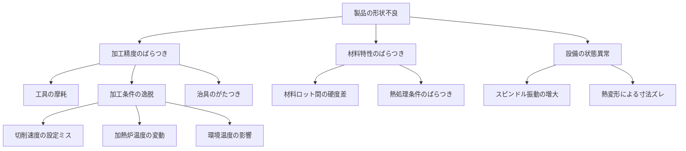

「取れるデータを集めて分析すれば、何か良いことが起きるはず」——そういう期待でDXを進めようとしていた時期があった。

ところが上司にこう問われた。「データを集めると、具体的にどういう仮説が立証されて価値につながるのか？」返す言葉がなかった。思い返せば、製造現場に機械学習モデルを適用するという話は5年前にもあった。うまくいった事例は少なかった。データから相関はわかっても、因果はわからない。

あるとき、現場の担当者からこう言われた。「自分たちは目視で製品の状況を確認して設備のパラメータを調整することもありますが、それをデータ化できていないなら制御はできないですよね」。そのとおりだった。問題は分析力でも精度でもなく、「何がつながっているか」の構造が誰にも見えていないことだった。

この記事は、その問いへの一つの答えとして実践した「調査前に因果の地図を作る」アプローチの記録だ。使うのはMermaid記法・Excel・Claudeの3つ。特別なツールはいらない。

## もぐら叩きになる構造

製造現場のDX推進は、こんな形で始まることが多い。

上位方針に「DXで生産性革新」が掲げられる。だが中身は抽象的で、現場への落とし方は各ライン責任者任せになる。データを取り始める、改善提案をする、分析ツールを入れる——それぞれのラインが独立して動く。

結果、個別最適の連鎖が起きる。Aラインで解決した問題がBラインで再発する。似たような調査が別々に走る。「うちのラインは特殊だから」という声が増え、全体像が誰にも見えなくなる。

データサイエンスのコンペ思考をそのまま持ち込むと、さらにずれる。精度を上げることがゴールになり、「その予測が現場のどの行動につながるのか」が曖昧なまま進む。現場が動かないのは当然だ。

問題は分析力ではなく、**全員が見られる因果構造の地図がないこと**だった。

## 解決の核心：調査前に仮説の地図を作る

通常の流れはこうだ。

```
課題感 → 調査票を配る → データ収集 → 分析 → 提案 → 現場が動かない
```

変えたのは最初のステップだ。

```
課題感 → Mermaidで因果仮説の地図を作る → ワイガヤで深める → 調査 → 分析 → 提案
```

調査前に「何と何がつながっているか」を可視化する。この地図があるから、ワイガヤが発散しすぎない。調査票の設計も迷わない。Claudeに分析させるときの道標にもなる。

## Step 1：Mermaidで因果仮説の地図を作る

以下は、あるラインの形状不良を起点に最初に作った因果仮説図だ。

作り方はシンプルだ。まず不良名を起点に「なぜ起きるか」を思いつくだけ書き出す。次にそれらをグループ化して中間要因を定義する。最後に矢印の方向（原因→結果）を確認しながらMermaidの`flowchart TD`に落とす。所要時間は30〜60分。完成度より「現場を巻き込む叩き台を作る」という目的意識で進めると手が止まらない。



起点は「製品の形状不良」。そこから「加工精度のばらつき」「材料特性のばらつき」「設備の状態異常」という3つの中間要因に分岐し、さらに具体的な変数（工具の摩耗・加熱炉温度・環境温度など）へと階層が下りていく。

最初は荒くていい。「たぶんこうつながっているだろう」という仮説で十分だ。**仮説が間違っていてもいい**と最初に伝えることが、現場を巻き込む上で一番大事なポイントになる。

Mermaidで描いた図はPNG画像にも出力できる。そのまま印刷して現場に貼ることも、メールでばらまくことも一手間かからない。

## Step 2：現場ワイガヤで仮説を深める

Mermaid図をA0サイズで印刷して現場に張り出す。付箋と油性ペンを用意して、「矢印が間違っていたら消す、抜けている要因があれば付箋で貼る」とだけ伝える。デジタルツールを使わず、全員が手を動かせる形にするのがポイントだ。

「この矢印は本当ですか？」「他につながりそうな要因はありますか？」——地図があることで会話の入り口ができる。ゼロから「何が問題だと思いますか？」と聞くより、ずっと深い議論になった。

印象的だったのは、最初は腕を組んで冷ややかに見ていた現場の主任の変化だ。議論が進むにつれて少しずつ近づいてきて、やがてまじまじと図を眺め始め、「これじゃ全然足りないな」と言いながら付箋を貼り始めた。地図がなければ、その主任の知識は最後まで引き出せなかっただろう。

ポイントは**1回で完成させようとしないこと**だ。最初は大きな粒度で張り出し、次の回で細分化する。可視化を何度も更新しながら、関係者の理解を段階的に深めていく。共有知になって初めて、方針が動き出す。

## Step 3：Excelで詳細調査台帳を作る

ワイガヤで洗い出した因果関係の各要素について、Excelの調査台帳に以下を記入してもらう。

| 要因 | データ化状況 | DB連携 | データ取得コスト | 備考 |
|---|---|---|---|---|
| 加工条件1 | ○ | あり | 低 | 設備ログから取得可 |
| 加工条件2 | △ | なし | 中 | 作業日報に手書き |
| 加熱炉温度 | ○ | あり | 低 | センサーログ取得済み |
| 環境温度 | × | なし | 高 | 計測器未設置 |

「○/△/×」で整理するだけで、DX化の現状が一目でわかる台帳になる。何がすでにデジタル化されていて、何がギャップかが一枚のシートに可視化される。

## Step 4：Claudeでサマリーを可視化しロードマップを描く

台帳が揃ったら、Claudeに渡す。

```
以下は製造ラインの因果構造調査台帳です。
各要因のデータ化状況・DB連携状況・取得コストが記録されています。

[台帳の内容をペースト]

以下を出力してください：
1. 工程別データ化サマリー（どの工程がどれだけデジタル化されているか）
2. DXの進行度評価（各工程のスコアと根拠）
3. 優先して取り組むべき工程と理由（効果×コストの観点で）
```

出てきたサマリーを叩き台に、経営層・現場・IT部門が同じ地図を見ながら議論できるようになった。「どのラインから始めるか」という意思決定が、データと構造に基づいて進むようになる。

## 現場に適用するときのポイント

**粒度のコントロールが最重要**。最初の因果図を細かく作りすぎると、ワイガヤがその図の正誤確認になってしまう。大きな粒度で始め、議論の中で細分化するのが自然な流れだ。

**ワイガヤのファシリテーションは「問い」で進める**。「この矢印は合ってますか？」「実際にこの影響を見たことがありますか？」「他につながりそうな要因はありますか？」——答えを求めるより、問いを投げかけ続ける役割に徹する。

**Claudeへの入力は「構造化したテキスト」で十分**。台帳をそのままペーストしても、Claudeは意外とうまく整理してくれる。きれいなフォーマットより、情報の網羅性の方が大事だ。

## 課題と対応アイデア

| 課題 | 対応アイデア |
|---|---|
| 現場が「自分のラインの話ではない」と思う | 担当ラインの不良を起点に因果図を作る |
| 因果関係が多すぎて収拾がつかない | 特定の不良モードに絞って因果図を作り直す |
| 経営層に伝わらない | Claudeのサマリーを「工程別DX進行度」として図示する |
| 因果図の更新が止まる | 月次の改善会議でMermaid図のレビューを議題に入れる |

## この地図はAI分析の道標にもなる

因果構造の可視化は、人間の議論だけのためではない。

AIがビッグデータを分析するとき、変数間の関係性を何も知らずに走らせると、相関は見つかっても「なぜそうなるのか」が説明できない分析になる。Mermaidで作った因果構造の地図は、そのままAIへの文脈情報として機能する。「この変数とこの変数は因果関係がある」という前提を持たせることで、的を射た分析が始まる。

先に地図を作ることで、人間とAIの両方が「正しい問い」を立てられるようになる。

## おわりに

このアプローチを終えた後、現場の責任者がこう言った。

> 「これは全ての改善活動の土台であって、全員ができるようになれば世界が変わる」

大げさな言い方に聞こえるかもしれない。でも、この言葉が出たとき、取り組みの意味が確信に変わった。

データを取る前に、地図を作る。地図が共有知になったとき、DXは動き出す。
